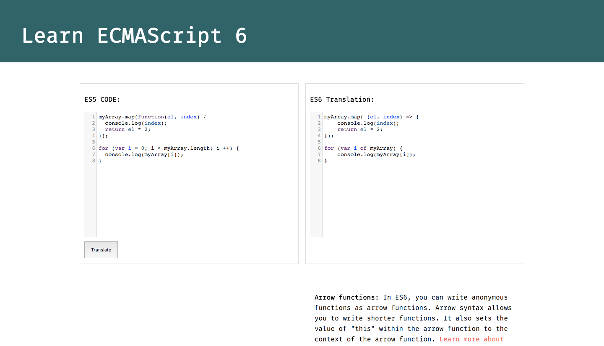

# Learn ECMAScript 6

ECMAScript 6, or ES6, is the first and most significant update to JavaScript since ES5 was standardized in 2009. We were very excited by the new features and wanted to make learning it as easy as possible.

There are a lot of informative documents written for learning ES6, but we wanted a more interactive tool. We asked ourselves, how might our ES5 code look different in ES6? And from there our web app was born.

## Usage
Input your ES5 JavaScript in the **ES5 Code** editor, click **Translate** and see what your code looks like in ES6 with some help tips at the bottom. That's it!

